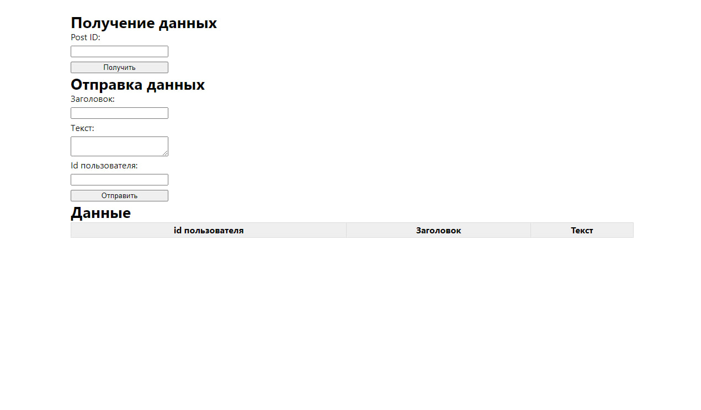
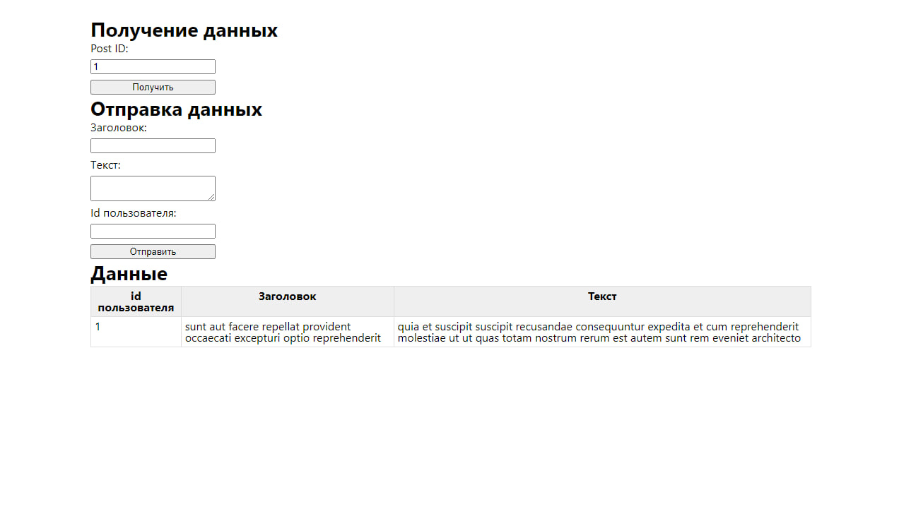
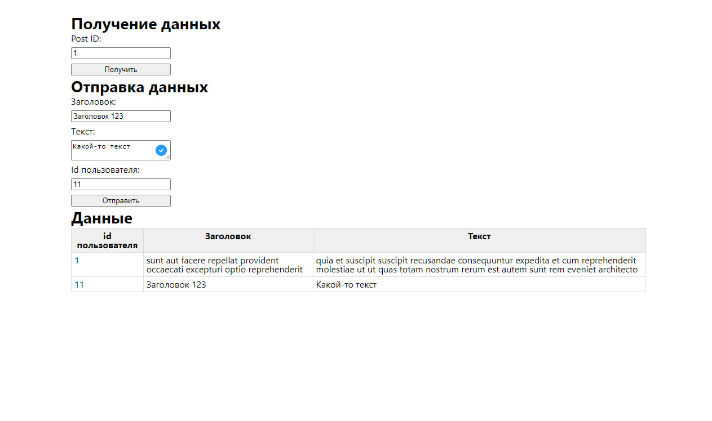

# PHP+Ajax

Интерфейс для получения и обновления данных от https://jsonplaceholder.typicode.com.
Для отправки запросов php на стороне сервера.

Форма получения данных:
В форме должно быть поле ввода Post ID
(при этом если поле пустое происходит запрос всех постов) и кнопка "Отправить" для запроса к указанному источнику.

Форма отправки данных:
В форме должны быть поля title, body, userid для обновления соответствующих полей и кнопка "Отправить"
для запроса к указанному источнику.

Вывод данных ответа обновляется посредством ajax.
